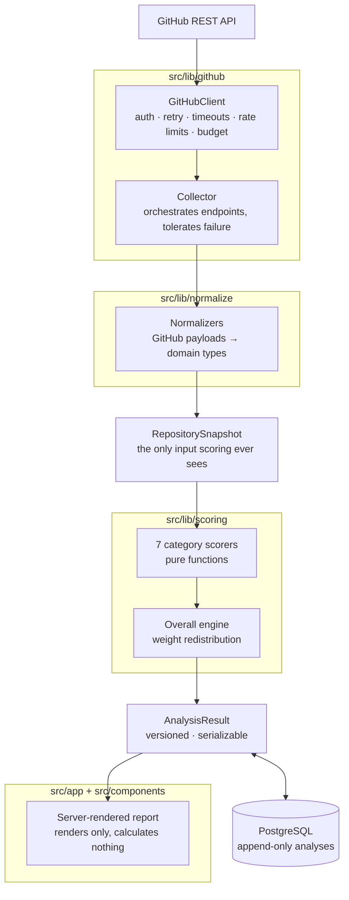
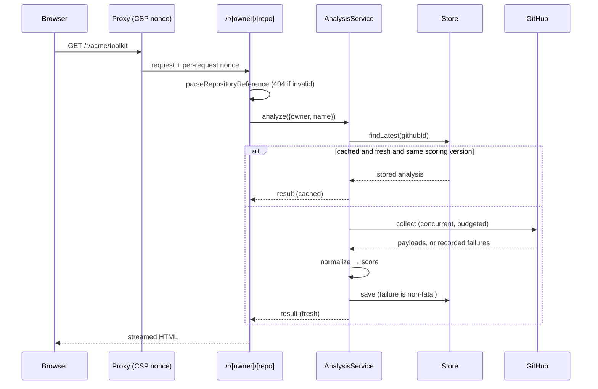

# Architecture

RepoSignal turns public GitHub data into an explainable engineering health
report. This document explains each layer, the boundary around it, and why the
boundary exists.

---

## The shape of it

The pipeline is a straight line with two enforced boundaries. Everything else
is a detail.

---

## The two boundaries

### 1. GitHub's vocabulary stops at normalization

No file outside `src/lib/github` and `src/lib/normalize` references a GitHub
API field name. Downstream code depends on `RepositorySnapshot`, a type this
project owns.

**Why it matters practically:** the scoring engine — where all the domain logic
lives — can be tested with plain object literals. A test for "median PR age at
exactly 90 days" is three lines, not a curated HTTP fixture. And when GitHub
changes a response shape, the blast radius is one directory and its tests.

### 2. The UI calculates nothing

Components render `AnalysisResult`. If a number appears on screen, a pure,
tested scoring function produced it.

**Why it matters practically:** it is impossible for the displayed score to
disagree with the tested score, because there is only one of them. When a
component needs a number that does not exist, the number gets added to the
scoring engine with tests, and then rendered.

---

## Layer by layer

### `src/lib/validation` — the SSRF boundary

Everything a user types passes through `parseRepositoryReference`, which
accepts `owner/repo`, GitHub URLs, deep links, and `git@` remotes, and returns
a validated `{ owner, name }` pair or a typed failure.

Host matching is **exact**, not substring — `github.com.evil.com` is rejected,
which a `.includes('github.com')` check would have accepted. Credentials in a
URL are rejected. Protocol-relative URLs are rejected before parsing, since
they would otherwise resolve against whatever base the parser is handed.

Errors never echo the rejected input, so a validation message cannot become an
injection vector one careless render later.

### `src/lib/github` — transport

A thin typed wrapper over `fetch`, [not Octokit](#why-not-octokit), carrying
every transport policy in one place.

**Request budget.** A hard cap on what one analysis may spend. Without it, a
repository with 8,000 open issues paginates until the rate limit is gone and
every other user is locked out. Exhausting the budget is not an error:
pagination stops and `truncated: true` comes back, so the caller can record it
and lower the affected category's confidence. `paginate` returns
`{ items, truncated }` precisely so truncation cannot be reported as
completeness.

**Retries.** 5xx and network faults only, with full jitter. A 4xx will not
become a 2xx by asking again. Jitter matters more than the base delay: without
it, concurrent analyses that hit a 5xx retry in lockstep.

**Rate limits.** Distinguishes the primary limit from the secondary abuse
limit, and fails immediately carrying the reset time. Waiting out a limit
inside a request handler converts a fast failure into a slow one.

**Redirects** are followed only when the target origin is `api.github.com`,
bounded to three hops. GitHub 301s `repos/{owner}/{name}` to its canonical
`repositories/{id}` for any renamed repository — `facebook/react` among them,
now `react/react` — so refusing all redirects made those repositories
unanalyzable. The SSRF concern was never same-origin canonicalization.

**The collector** treats only the repository endpoint as required. Every other
endpoint may fail, recording a `CollectionReport` entry and leaving its field
`null`; a repository whose workflow runs are unreadable still deserves a
documentation score. Rate limits are the exception and are rethrown, because
continuing past one produces a snapshot that is mostly holes. Independent
collections run concurrently — sequentially, a large repository took 14.5s.

### `src/lib/normalize` — translation

GitHub payloads in, domain types out. Every function is total: unparseable or
absent input becomes `null`, never a default, because a default is
indistinguishable from an observation once it reaches scoring.

Three specific translations carry most of the correctness:

| Observation                         | Naive reading         | What is recorded          |
| ----------------------------------- | --------------------- | ------------------------- |
| `/issues` returns pull requests     | Inflated issue counts | PRs discarded             |
| `stats/commit_activity` returns 202 | Zero commits          | `null` — still computing  |
| `branches/*/protection` returns 403 | Not protected         | `null` — unable to verify |

### `src/lib/scoring` — the product

Pure functions: `(snapshot, now) => CategoryScore`. No I/O, no clock access, no
randomness. `now` is injected so results are reproducible.

`combine()` in `primitives.ts` is where null preservation lives: components
that could not be evaluated are excluded and their weight redistributed.
`overall.ts` does the same one level up for categories.

Full methodology in [docs/SCORING.md](docs/SCORING.md).

### `src/lib/analysis` — orchestration

Cache lookup, collection, scoring, persistence, and the three policies every
entry point needs: a 15-minute freshness window, in-flight deduplication so ten
concurrent visitors cost one analysis, and invalidation when `scoringVersion`
changes.

A persistence failure never fails an analysis that already succeeded — the user
gets their result and the cache simply misses next time.

### `src/lib/store` — persistence

An interface with two implementations, for one concrete reason: **the
application must run without a database.** No `DATABASE_URL` means the
in-memory store, tests use the same one, and CI needs no Postgres container.

Repository identity is GitHub's immutable numeric id, not `owner/name`.
Repositories get renamed and transferred; keying on the mutable name would
silently fork one project's history into two records.

Analyses are append-only, so a cache read is "the most recent row, if fresh
enough", and historical score tracking needs no schema change to add.

### `src/app` and `src/components` — presentation

Server-rendered. The only client JavaScript is the search form, which posts to
a server action and works before hydration.

The methodology disclosure is a native `
` element rather than a
state-driven component: it works without JavaScript, is keyboard operable, and
is announced correctly by screen readers. The single most important affordance
in the product should also be the least fragile thing on the page.

---

## Request flow

---

## Engineering decisions

### Why deterministic scoring instead of an LLM?

A health score has to be reproducible and arguable. Deterministic scoring means
the same snapshot always yields the same result, every threshold can be unit
tested, and a user who disagrees can be shown the exact rule that produced the
number. An LLM-generated score is none of those things.

AI remains a possible _presentation_ layer — rephrasing finished findings — but
it will never compute or adjust a number.

### Why not Octokit?

Three policies were the deciding factor, and all three are visible in the
public signatures of the client: a hard per-analysis request budget, sample
truncation surfaced to the caller rather than hidden, and rate-limit handling
that fails fast with a reset time. Expressing those on top of a general-purpose
client meant fighting it. A thin typed `fetch` wrapper made the policies
explicit and the whole layer trivially mockable.

### Why no charting library?

The charts are static distributions with no interactivity requirement.
Server-rendered SVG ships zero client JavaScript and makes the accessible-text
alternative a natural part of the markup rather than a retrofit.

### Why is every route dynamic?

Next.js streams Suspense boundaries through inline `<script>` tags. A strict
`script-src 'self'` policy blocks them, leaving the page on its loading state
forever while the streamed HTML underneath is perfectly correct — a bug only a
real browser reveals.

The alternatives were `'unsafe-inline'`, which defeats most of the point of
having a script CSP, or a per-request nonce. RepoSignal takes the nonce, set in
`src/proxy.ts`. Nonces are injected during rendering, so every route must
render dynamically: the homepage gives up prerendering to get a strict script
policy. For an application whose subject is engineering diligence, that is the
right side of the trade — but it is a trade, and it is recorded as one.

`style-src` keeps `'unsafe-inline'` because score bars use inline style
_attributes_, for which CSP has no nonce mechanism. Inline styles are a far
weaker vector than inline scripts.

### Why no Redis, queue, or microservices?

No current requirement justifies them. The rate limiter is in-memory and
therefore per-instance, which is written down in its module comment rather than
hidden, because someone scaling this horizontally needs to know the guarantee
weakens.

---

## Testing strategy

| Layer       | Location            | Proves                                               |
| ----------- | ------------------- | ---------------------------------------------------- |
| Unit        | `tests/unit`        | Each threshold, each null path, in isolation         |
| Integration | `tests/integration` | The layers compose, network mocked with MSW          |
| Component   | `tests/components`  | Every UI state renders correctly                     |
| E2E         | `tests/e2e`         | The journey works in a browser, against a real build |

**No test contacts the live GitHub API.** Unit tests use plain literals,
integration tests use MSW with `onUnhandledRequest: 'error'`, and E2E runs the
built app with `GITHUB_FIXTURES=1`. CI is therefore immune to rate limits and
outages.

Fixture mode is an explicit service option resolved once in the container, not
a `process.env` read inside the service — ambient state changing what a service
does is how the unit suite once got silently redirected to bundled data.

Behaviour against the live API is verified separately with
`npm run analyze -- owner/repo`.
