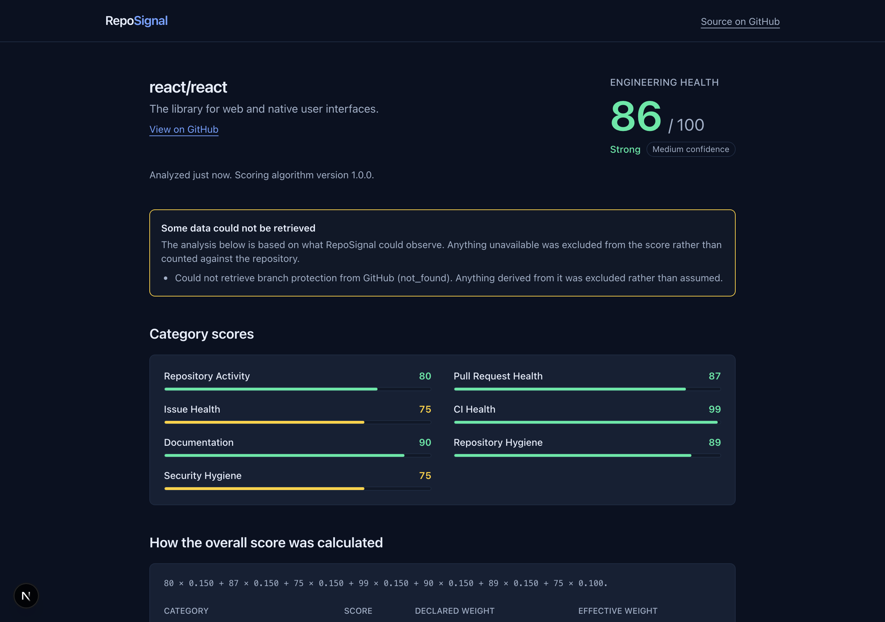
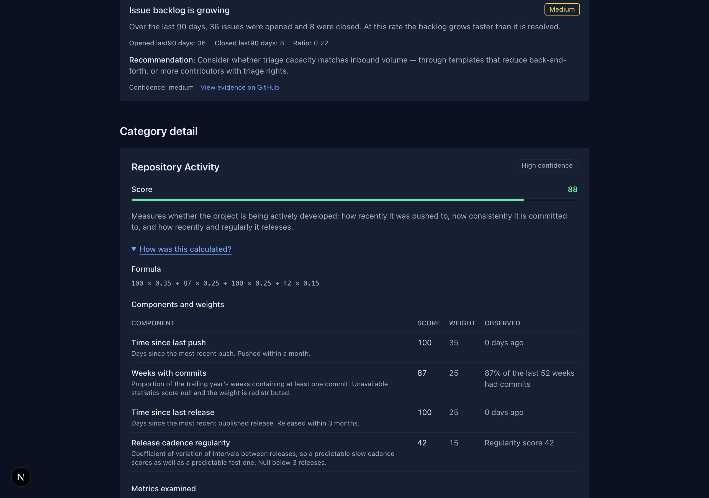
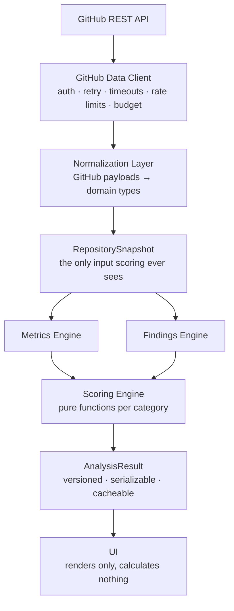

# RepoSignal

**Evidence-backed engineering health analysis for public GitHub repositories.**

[](https://github.com/mateoosoriodelhonte/reposignal/actions/workflows/ci.yml)
[](LICENSE)

**[Try it →](https://reposignal-lovat.vercel.app)** · [Scoring methodology](docs/SCORING.md) · [Architecture](ARCHITECTURE.md)

RepoSignal takes a repository like `facebook/react` and reports how the project
is actually being engineered — activity, pull request flow, issue backlog, CI,
documentation, hygiene, and security practices — with every number traceable to
the public GitHub data it came from.



---

> **Live demo:** [reposignal-lovat.vercel.app](https://reposignal-lovat.vercel.app)
>
> The demo runs without a GitHub token, so it shares GitHub's unauthenticated
> rate limit and may be temporarily unavailable under load. Running it locally
> with a token — which needs no scopes — gives 5,000 requests an hour.

## Why this exists

Judging an unfamiliar repository usually means skimming the README, glancing at
the commit graph, and guessing. Star counts measure popularity, not health, and
most "repo score" tools produce a number with no way to interrogate it.

RepoSignal is built on the opposite premise: **a score you cannot audit is not
worth showing.** Every category expands to reveal the metrics examined, their
raw values, the weights applied, the thresholds used, and links to the evidence
on GitHub.



## The rule that shapes the architecture

> **Missing data is not evidence of poor health.**

A repository whose commit statistics GitHub has not computed is not unhealthy —
it is unmeasured. So an unobservable metric is `null`, a category with too
little data scores `null` rather than `0`, and a `null` category is excluded
from the overall score with its weight redistributed across the categories that
did produce one.

The consequence is asserted directly by a test: **adding a `null` category can
never lower the overall score.**

Silently turning missing data into a zero is the easiest way to make a health
score dishonest, and avoiding it drove most of the type design. You can see it
working in the screenshot above: branch protection needs permissions RepoSignal
does not have, so it is reported as unverifiable and excluded — not counted as
a failure.

## What it measures

| Category            | Weight | Examples of what is observed                               |
| ------------------- | ------ | ---------------------------------------------------------- |
| Repository Activity | 15     | Commit cadence, last push, release recency and regularity  |
| Pull Request Health | 15     | Open PR ages, merge velocity, long-lived open PRs          |
| Issue Health        | 15     | Backlog age, stale issues, open/close rates                |
| CI Health           | 15     | Workflows present, recent run outcomes, repeated failures  |
| Documentation       | 15     | README, CONTRIBUTING, LICENSE, templates, docs directory   |
| Repository Hygiene  | 15     | Lockfiles, CODEOWNERS, dependency automation, release tags |
| Security Hygiene    | 10     | `SECURITY.md`, dependency automation, scanning in CI       |

The last one is deliberately called _hygiene_, not _security score_. RepoSignal
observes practices; it does not scan for vulnerabilities and will never claim a
repository is secure. There is a test that collects every user-facing string in
that module and asserts none of them says so.

Every threshold and formula is documented in [docs/SCORING.md](docs/SCORING.md).

## What it deliberately does not do

- Analyze private repositories
- Clone, download, or execute repository code
- Perform vulnerability scanning or credential hunting
- Use an LLM to produce or adjust any score
- Rank repositories against one another

## Architecture



Two boundaries are enforced:

1. **GitHub response shapes never escape normalization.** Nothing downstream
   references a GitHub-specific field name, so an API change is contained to one
   directory — and the scoring engine can be tested with plain object literals
   instead of recorded HTTP fixtures.
2. **The UI calculates nothing.** If a number is on screen, a pure, tested
   scoring function produced it.

[ARCHITECTURE.md](ARCHITECTURE.md) covers each layer and the reasoning behind it.

## Stack

Next.js 16 (App Router) · React 19 · TypeScript (strict, plus
`noUncheckedIndexedAccess` and `exactOptionalPropertyTypes`) · Tailwind CSS v4 ·
PostgreSQL + Prisma 7 · Zod · Vitest · React Testing Library · Playwright · MSW ·
GitHub Actions

## Local development

```bash
git clone https://github.com/mateoosoriodelhonte/reposignal.git
cd reposignal
npm install
cp .env.example .env.local
echo "GITHUB_TOKEN=$(gh auth token)" >> .env.local
npm run dev
```

The token needs **no scopes** — RepoSignal reads only public data, and an
unscoped token exists solely to raise the rate limit from 60 to 5,000 requests
per hour. **A database is optional**: without `DATABASE_URL`, analyses are
cached in memory instead of surviving a restart.

Full setup in [docs/LOCAL_DEVELOPMENT.md](docs/LOCAL_DEVELOPMENT.md).

You can also run the pipeline without the UI:

```bash
npm run analyze -- facebook/react
```

## Testing

```bash
npm test              # unit, integration, component — 477 tests
npm run test:coverage # with coverage thresholds
npm run test:e2e      # Playwright — 22 specs
npm run lint
npm run typecheck
```

| Layer       | Proves                                               |
| ----------- | ---------------------------------------------------- |
| Unit        | Every threshold and null path, in isolation          |
| Integration | The layers compose, network mocked with MSW          |
| Component   | Every UI state renders correctly                     |
| E2E         | The journey works in a browser, against a real build |

**No test contacts the live GitHub API.** Integration tests use MSW configured
so an unhandled request fails the test rather than escaping; E2E runs the built
app against bundled fixture snapshots. CI is therefore immune to rate limits
and outages.

## Engineering decisions

Tradeoffs worth explaining, since they shaped the codebase more than the stack
choices did.

### Why deterministic scoring instead of an LLM?

A health score has to be reproducible and arguable. Deterministic scoring means
the same snapshot always yields the same result, every threshold can be unit
tested, and a user who disagrees can be shown the exact rule that produced the
number. An LLM-generated score is none of those things. AI remains a possible
_presentation_ layer — rephrasing finished findings — but it will never compute
or adjust a number.

### Why preserve unknown values instead of defaulting to zero?

Because the alternative is lying. Defaulting a missing value to `0` would
penalize a repository for GitHub's incomplete statistics or for a permission
RepoSignal does not have. This is why `score: number | null` appears
throughout, and why `null` propagates all the way to a UI that renders
"Insufficient data" rather than a number.

### Why a hand-written GitHub client instead of Octokit?

Three policies were the deciding factor, and all three are visible in the
client's public signatures: a hard per-analysis request budget, sample
truncation surfaced to the caller rather than hidden (`paginate` returns
`{ items, truncated }`), and rate-limit handling that fails fast with a reset
time instead of retrying into the wall. Expressing those on top of a
general-purpose client meant fighting it.

### Why is repository identity the numeric ID?

Repositories get renamed and transferred. `owner/name` is a mutable lookup key;
GitHub's numeric `id` is the stable identity. This is not theoretical — while
building this, `facebook/react` turned out to now be `react/react`, and GitHub
301s the old path to the canonical one. Keying history on the numeric id means
a rename resolves cleanly instead of forking into two records.

### Why is every route dynamically rendered?

Next.js streams Suspense boundaries through inline `<script>` tags, so a strict
`script-src 'self'` policy blocks them — leaving every analysis stuck on its
loading state while the streamed HTML underneath is perfectly correct. The
alternatives were `'unsafe-inline'`, which defeats most of the point of a
script CSP, or a per-request nonce. RepoSignal takes the nonce, and pays for it
by giving up prerendering, since nonces are injected at render time.

That is a real trade, recorded as one rather than presented as a free win.

### Why no charting library?

The charts are static distributions with no interactivity requirement.
Server-rendered SVG ships zero client JavaScript and makes the accessible-text
alternative a natural part of the markup rather than a retrofit.

## Accessibility

Semantic HTML throughout, a skip link, visible focus states, labelled form
controls, and WCAG AA contrast. **Score is never communicated by colour alone**
— every score carries a number and a text band. The methodology disclosure is a
native `<details>` element, so it is keyboard operable and announced correctly
without any custom ARIA. E2E asserts a keyboard-only path through the primary
journey and that the page never scrolls horizontally at 375px.

## Roadmap

Out of scope for v1.0, recorded so the boundary is intentional: repository
comparison, organization dashboards, historical score tracking, score-change
alerts, private repositories via a GitHub App, scheduled analyses, shareable
reports, a public API, README score badges, benchmark cohorts, and an optional
AI executive summary that rephrases findings without altering any score.

## Contributing

Contributions are welcome — see [CONTRIBUTING.md](CONTRIBUTING.md). Issues
labelled [`good first issue`](https://github.com/mateoosoriodelhonte/reposignal/labels/good%20first%20issue)
are scoped to be completable without deep context.

## License

[MIT](LICENSE)
