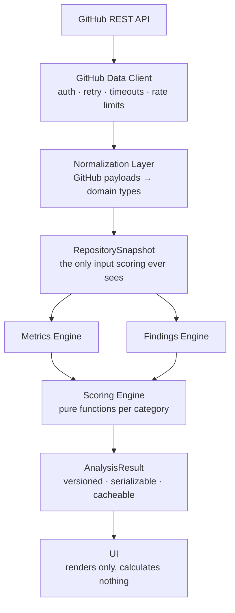

# RepoSignal

**Evidence-backed engineering health analysis for public GitHub repositories.**

[](https://github.com/mateoosoriodelhonte/reposignal/actions/workflows/ci.yml)
[](LICENSE)

RepoSignal takes a repository like `facebook/react` and reports how the project
is actually being engineered — activity, pull request flow, issue backlog, CI,
documentation, hygiene, and security practices — with every number traceable to
the public GitHub data it came from.

> **Status:** in active development toward v1.0. See the
> [v1.0 milestone](https://github.com/mateoosoriodelhonte/reposignal/milestone/1)
> for what is built and what is left.

---

## Why this exists

Judging an unfamiliar repository usually means skimming the README, glancing at
the commit graph, and guessing. Star counts measure popularity, not health, and
most "repo score" tools produce a number with no way to interrogate it.

RepoSignal is built on the opposite premise: **a score you cannot audit is not
worth showing.** Every category can be expanded to reveal the metrics examined,
their raw values, the weights applied, the thresholds used, and the evidence
links — and where the data was not available, it says so instead of guessing.

## The rule that shapes the architecture

> **Missing data is not evidence of poor health.**

A repository whose commit statistics GitHub has not computed is not unhealthy —
it is unmeasured. So an unobservable metric is `null`, a category with too
little data scores `null` rather than `0`, and a `null` category is excluded
from the overall score with its weight redistributed across the categories that
did produce one.

Silently turning missing data into a zero is the single easiest way to make a
health score dishonest, and avoiding it drove most of the type design.

## What it measures

| Category            | Weight | Examples of what is observed                               |
| ------------------- | ------ | ---------------------------------------------------------- |
| Repository Activity | 15     | Commit cadence, last push, release recency and regularity  |
| Pull Request Health | 15     | Open PR ages, merge velocity, long-lived open PRs          |
| Issue Health        | 15     | Backlog age, stale issues, open/close rates                |
| CI Health           | 15     | Workflows present, recent run outcomes, repeated failures  |
| Documentation       | 15     | README, CONTRIBUTING, LICENSE, templates, docs directory   |
| Repository Hygiene  | 15     | Lockfiles, CODEOWNERS, dependency automation, release tags |
| Security Hygiene    | 10     | `SECURITY.md`, dependency automation, scanning in CI       |

The last one is deliberately called _hygiene_, not _security score_. RepoSignal
observes practices; it does not scan for vulnerabilities and will never claim a
repository is secure.

## What it deliberately does not do

- Analyze private repositories
- Clone, download, or execute repository code
- Perform vulnerability scanning or credential hunting
- Use an LLM to produce or adjust any score
- Rank repositories against one another

## Architecture



Two boundaries are enforced:

1. **GitHub response shapes never escape normalization.** Nothing downstream
   references a GitHub-specific field name, so an API change is contained to one
   directory.
2. **The UI calculates nothing.** If a number is on screen, a pure, tested
   scoring function produced it.

See [ARCHITECTURE.md](ARCHITECTURE.md) for the full design and
[docs/SCORING.md](docs/SCORING.md) for every threshold and formula.

## Stack

Next.js 16 (App Router) · React 19 · TypeScript (strict) · Tailwind CSS v4 ·
PostgreSQL + Prisma · Zod · Vitest · React Testing Library · Playwright · MSW ·
GitHub Actions

## Local development

```bash
git clone https://github.com/mateoosoriodelhonte/reposignal.git
cd reposignal
npm install
cp .env.example .env.local
```

Add a GitHub token to `.env.local`. It needs **no scopes** — RepoSignal reads
only public data, and an unscoped token raises the rate limit from 60 to 5,000
requests per hour:

```bash
echo "GITHUB_TOKEN=$(gh auth token)" >> .env.local
```

Then:

```bash
npm run dev
```

Full setup, including the database, is in
[docs/LOCAL_DEVELOPMENT.md](docs/LOCAL_DEVELOPMENT.md).

## Testing

```bash
npm test              # unit + integration
npm run test:coverage # with coverage thresholds
npm run test:e2e      # Playwright
npm run lint
npm run typecheck
```

Tests never touch the live GitHub API. Unit tests run against fixtures,
integration tests mock the network with MSW, and E2E runs the built app with
bundled fixture snapshots. CI is therefore immune to GitHub rate limits and
outages.

## Engineering decisions

Tradeoffs worth explaining, since they shaped the codebase more than the stack
choices did.

### Why deterministic scoring instead of an LLM?

A health score has to be reproducible and arguable. Deterministic scoring means
the same snapshot always yields the same result, every threshold can be unit
tested, and a user who disagrees with a score can be shown the exact rule that
produced it. An LLM-generated score is none of those things. AI remains a
possible _presentation_ layer — rephrasing finished findings — but it will never
compute or adjust a number.

### Why normalize GitHub responses?

External API schemas should not define internal business logic. Normalization
keeps GitHub's field names, pagination quirks, and inconsistencies inside one
directory. The scoring engine — the part with the actual domain logic — depends
only on types this project owns, so it can be tested with plain object literals
instead of recorded HTTP fixtures.

### Why preserve unknown values instead of defaulting to zero?

Because the alternative is lying. Defaulting a missing value to `0` would
penalize a repository for GitHub's incomplete statistics. This is why
`score: number | null` appears throughout, and why `null` propagates all the way
to a UI that renders "Insufficient data" rather than a number.

### Why a hand-written GitHub client instead of Octokit?

RepoSignal needs specific policies: a hard per-analysis request budget, sample
truncation recorded on the snapshot so it can lower a category's confidence,
and rate-limit accounting that fails clearly rather than retrying into the wall.
Expressing those on top of a general-purpose client meant fighting it. A thin
typed `fetch` wrapper made the policies explicit and the whole layer trivially
mockable.

### Why no charting library?

The charts are static distributions with no interactivity requirement. Rendering
them as server-generated SVG ships zero client JavaScript and makes the
accessible-text alternative a natural part of the markup rather than a retrofit.

### Why is repository identity the numeric ID?

Repositories get renamed and transferred. `owner/name` is a mutable lookup key;
GitHub's numeric `id` is the stable identity. Keying analysis history on the
numeric id means a renamed repository keeps its history instead of silently
forking into two records.

## Roadmap

Out of scope for v1.0, recorded so the boundary is intentional: repository
comparison, organization dashboards, historical score tracking, score-change
alerts, private repositories via a GitHub App, scheduled analyses, shareable
reports, a public API, README score badges, benchmark cohorts, and an optional
AI executive summary that rephrases findings without altering any score.

## Contributing

Contributions are welcome — see [CONTRIBUTING.md](CONTRIBUTING.md). Issues
labelled [`good first issue`](https://github.com/mateoosoriodelhonte/reposignal/labels/good%20first%20issue)
are scoped to be completable without deep context.

## License

[MIT](LICENSE)
